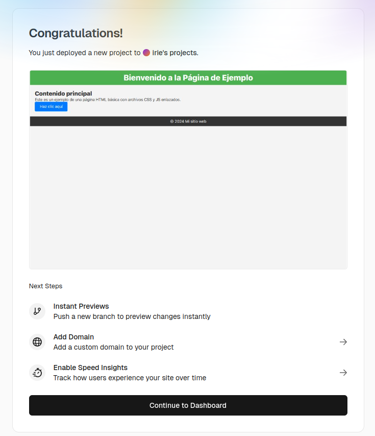

### **Examen - RA6: Creació i Gestió d'un Projecte Web amb Git i Desplegament en Vercel**


### **Instruccions**

#### **1. Configuració inicial**

1. Comprova la versió instal·lada de Git, fes captura del terminal.
```bash
git --version
```
  

2. Configura Git al teu sistema (opcional)
```bash
git  config --global user.name "irie.yamashita"
git  config --global user.email irie.yamashita.7e8@itb.cat

git config --global -e

[alias]
        s = status --short
        ch = checkout
        l = log --oneline --decorate --all --graph
        last = log -1 --color=always --format='%C(yellow)%h%Creset %C(green)%s%Creset -> %C(blue)%an%Creset (%ad)'
        cm = commit
        br = branch
```

3. Mostra la configuració actual per verificar-ho, fes captura del terminal. Explica com veig que he configurat correctament el email i el nom.
```bash
git config --global -e
```
  

> Pots veure el nom i l'email a l'apartat **[user]** que t'apareixarà si poses `git config --global -e`.

5. Inicia un nou repositori Git al directori de treball on consideris. El nom del directorio ha de ser `Cognom1Cognom2Examen2425`.

```bash
mkdir YamashitaLopezExamen2425
cd YamashitaLopezExamen2425/
git init .
```

6. Crea un document README.md, afegeix el document i fes un primer commit que amb el missatge `1 - Git init`
---

```bash
touch README.md
git add .
git s
git commit -m "1 - Git init"
git l
```

Captura punts 5 i 6:  
  


#### **2. Creació del projecte web**

1. **Crea els fitxers següents al directori del projecte:**  
   - `index.html`
   - `testunitari.html`
   - `style.css`  
   - `main.js`  

```bash
touch index.html testunitari.html style.css main.js
ls
```
2. Afegeix contingut bàsic a cada fitxer.
```bash
nano index.html 
nano testunitari.html 
nano style.css 
nano main.js 
```
Captura apartat 2:  

---


#### **3. Gestió amb Git**

1. **Afegir fitxers:**  
   - Utilitza un patró d'expressió regular per afegir tots els fitxers `.html` i `.css`. Fes captura del terminal   

```bash
git add *.html
git add *.css
```
2. **Verifica l'estat del repositori, fes captura del terminal**  

```bash
git s
```
  

3. **Elimina `testunitari.html` del staging**  
```bash
git reset testunitari.html
git s
```

4. **Fes un commit que amb el missatge '2- Estructura bàsica'**  
```bash
git cm -m "2- Estructura bàsica"
```

Captura punts 3 i 4:  
 
 
 5. **Consulta l'historial de commits, fes captura del terminal.**  
   

---

#### **4. Creació de branques i documentació**

1. **Crea una nova branca per a la documentació** 
```bash
git branch documentacio
git checkout documentacio
git branch --all
```

2. **Crea un fitxer `README.md` si es necessari:**  
   - Explica dins del fitxer el propòsit del projecte.  

```bash
touch README.md
nano README.md 
```

  

3. **Afegeix i fes commit dels canvis a la branca `documentacio`.**
El missatge del commit ha de ser "3 - README.md amb documentació inicial"
```bash
git add README.md 
git cm -m "3 - README.md amb documentació inicial"
git l
```

Captura punts 1, 2 i 3:   


4. **Torna a la branca principal (`main`) i fes un merge** 
```bash
git ch main
git merge documentacio
```

  

   
---

#### **5. Remot i publicació**

1. Configura un remot per al repositori que has de crear en GitHub, el nom del repositorio de GitHub ha de ser `Cognom1Cognom2Examen2425`. Fes captura al terminal de com has configurat el repositori remot.
  

```bash
git remote add YamashitaLopezExamen2425 https://github.com/irie-yamashita/YamashitaLopezExamen2425.git
```

  

2. **Puja els canvis al remot desde terminal**.Fes captura al terminal.

```bash
git push YamashitaLopezExamen2425 main
```
  

Comprovo a GitHub:  
  

4. **Publica el projecte a Vercel i indica l'enllaç en el document Markdown del examen.**




**ENLLAÇ**: [enllaç Vercel](https://yamashita-lopez-examen2425.vercel.app/)  
